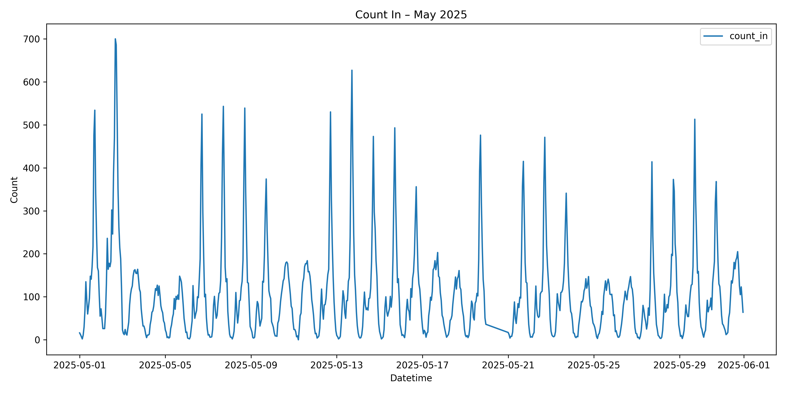
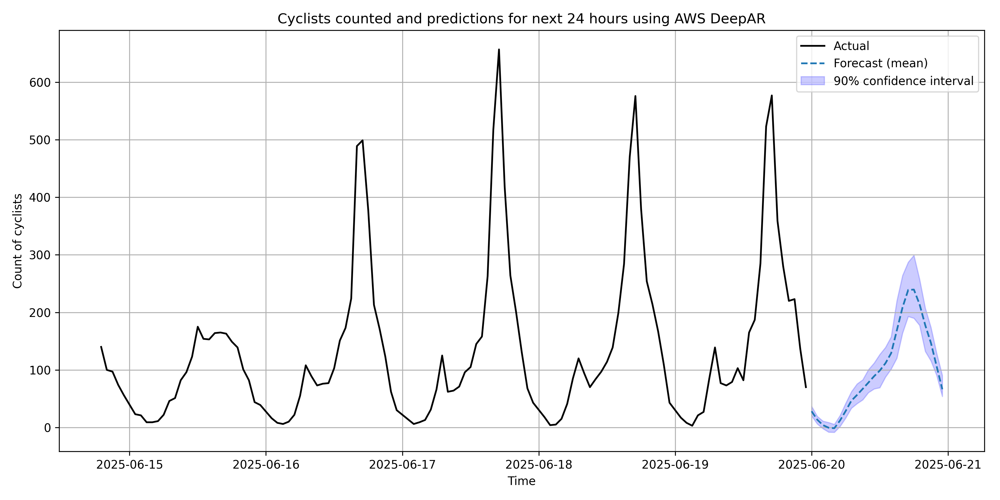

# camden-cycling

Data is from Camden's Open access API. There are several cycle counters in Camden which provide counts of cyclists along these routes. I focus on a cycle counter at located near 51.5575°N, 0.1486°W, which is in Kentish Town in London, chosen arbitrarily.

Training is done using AWS DeepAR, following their [guides](https://docs.aws.amazon.com/sagemaker/latest/dg/deepar.html#deepar-sample-notebooks) and [notebooks](https://github.com/aws/amazon-sagemaker-examples/tree/main/introduction_to_amazon_algorithms/deepar_electricity). 

The model takes the previous 72 hours and predicts the next 24. 



## Prediction

I deployed the `Estimator` to an async serverless endpoint. It was trained on one month of data from May 2025, and here I test a prediction on the most recent data June 2025. I'm testing it on a Friday and it does predict less usage tomorrow (Saturday) which does seem correct. Perhaps it has picked this up from seeing a midweek spike over the past 72 hours, and anticipates a quieter weekend, which seems correct to me!



## Project structure
- `create_estimator.py` — fetches data, converts to DeepAR format, and uses a DeepAR container to train the model
- `deploy_endpoint.py` — deploys serverless inference endpoint
- `invoke_endpoint.py` — sends requests to endpoint and plots predictions
- `helpers.py` — utilities for data transformation and S3 uploads

## Environment set up

This project uses poetry, so use `poetry install`. I ran the above scripts using this pattern:
```
poetry run python3 src/create_estimator.py
```   

## Further ideas


- [ ] Deploy on a flask app, e.g. using app runner
- [ ] Evaluate accuracy
- [ ] Analyse model errors, e.g. seasonality
- [ ] Include other features, e.g. time of day, temperature
- [ ] Train over a longer period - currently just uses June 2025 but might not predict a rainy February very accurately
- [ ] Add tests
- [ ] Add ruff for linting and formatting and docstrings
- [ ] Add mypy for typing
 